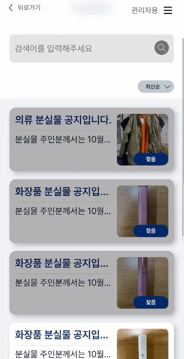
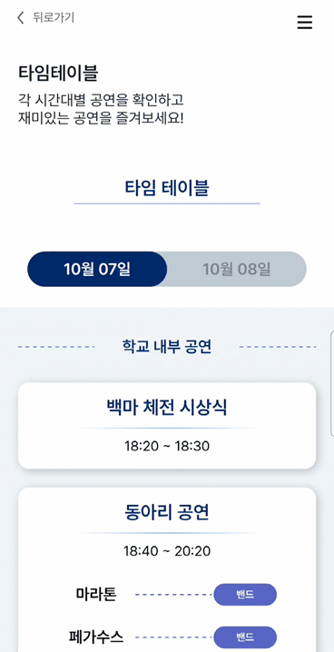
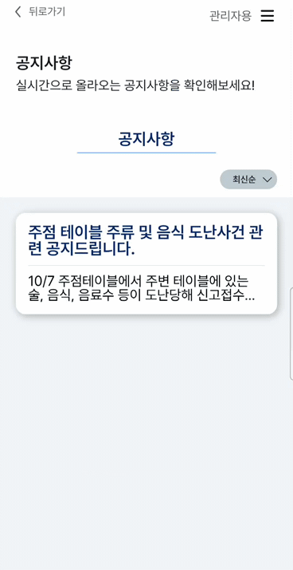

# 서비스
<a href="https://mju-majesty.com">MJU Majesty 서비스 바로가기</a>

# 기능 소개

### 랜딩 페이지 / 메인페이지 / 로그인

<table>
    <td><p>랜딩</p></td>
    <td><p>메인</p></td>
    <td><p>로그인</p></td>
</table>

### 부스 및 도장판

<table>
  <tr>
    <td><p>QR 발급(관리자)</p></td>
    <td><p>QR 촬영 및 도장판(학생)</p></td>
    <td><p>QR 시연 이미지</p></td>
  </tr>
  <tr>
    <td><p>부스 정보 수정</p></td>
    <td><p>부스 리스트 조회</p></td>
    <td><p>부스 필터</p></td>
  </tr>
</table>

### 분실물

<table>
  <td><p>분실물 찾기</p></td>
</table>

### 타임테이블

<table>
  <td><p>타임테이블 조회</p></td>
</table>

### 공지사항

<table>
  <td><p>공지사항</p></td>
</table>

### 지도

<table>
  <td><p>지도</p></td>
</table>

---


# 📠 Convention

## 🤝 Branch Naming Convention

| 머릿말   | 설명                               |
| -------- | ---------------------------------- |
| main     | 서비스 브랜치                      |
| develop  | 배포 전 작업 기준                  |
| feature  | 기능 단위 구현                     |
| hotfix   | 서비스 중 긴급 수정 건에 대한 처리 |
| refactor | 리팩토링                           |

<details>
<summary>Branch Naming Convention Detail</summary>
<div markdown="1">

```
master(main) ── develop ── feature
└── hotfix
```

- [ ] [깃 플로우](https://techblog.woowahan.com/2553/)를 베이스로 하여 프로젝트 사이즈에 맞게 재정의했습니다.
- [ ] 브랜치 이름은 `cabab-case`를 따릅니다.
- [ ] 이슈 번호는 가장 처음에 적습니다.

#### master(main)

- [ ] 실제 서비스가 이루어지는 브랜치입니다.
- [ ] 이 브랜치를 기준으로 develop 브랜치가 분기됩니다.
- [ ] 배포 중, 긴급하게 수정할 건이 생길시 hotfix 브랜치를 만들어 수정합니다.

#### develop

- [ ] 개발, 테스트, 릴리즈 등 배포 전 작업의 기준이 되는 브랜치입니다.
- [ ] 해당 브랜치를 default로 설정합니다.
- [ ] 이 브랜치에서 feature 브랜치가 분기됩니다.

#### feature

- [ ] 개별 개발자가 맡은 작업을 개발하는 브랜치입니다.
- [ ] feature/(feature-name) 과 같이 머릿말을 feature, 꼬릿말을 개발하는 기능으로 명명합니다.
- [ ] feature-name의 경우 cabab-case를 따릅니다.
- [ ] ex) feature/login-validation

#### hotfix

- [ ] 서비스 중 긴급히 수정해야 할 사항이 발생할 때 사용합니다.
- [ ] master에서 분기됩니다.

</div>
</details>

## 🤝 Commit Convention

| 머릿말           | 설명                                                                      |
| ---------------- | ------------------------------------------------------------------------- |
| feat             | 새로운 기능 추가                                                          |
| fix              | 버그 수정                                                                 |
| design           | CSS 등 사용자 UI 디자인 변경                                              |
| !BREAKING CHANGE | 커다란 API 변경의 경우                                                    |
| !HOTFIX          | 코드 포맷 변경, 세미 콜론 누락, 코드 수정이 없는 경우                     |
| refactor         | 프로덕션 코드 리팩토링업                                                  |
| comment          | 필요한 주석 추가 및 변경                                                  |
| docs             | 문서 수정                                                                 |
| test             | 테스트 추가, 테스트 리팩토링(프로덕션 코드 변경 X)                        |
| setting          | 패키지 설치, 개발 설정                                                    |
| chore            | 빌드 테스트 업데이트, 패키지 매니저를 설정하는 경우(프로덕션 코드 변경 X) |
| rename           | 파일 혹은 폴더명을 수정하거나 옮기는 작업만인 경우                        |
| remove           | 파일을 삭제하는 작업만 수행한 경우                                        |

<details>
<summary>Commit Convention Detail</summary>
<div markdown="1">

- `<타입>`: `<제목> - <이슈번호>` 의 형식으로 제목을 아래 공백줄에 작성
- 제목은 50자 이내 / 변경사항이 "무엇"인지 명확히 작성 / 끝에 마침표 금지
- 예) feat: 로그인 기능 추가 - #2
- 본문(구체적인 내용)을 아랫줄에 작성
- 여러 줄의 메시지를 작성할 땐 "-"로 구분 (한 줄은 72자 이내)
- 제목과 본문은 한 줄 띄워 분리

</div>
</details>

## 🤝 Naming Convention

### 기본 네이밍 컨벤션

1. 컴포넌트는 `PascalCase` 사용
2. 폴더명은 `camelCase` 사용
3. 파일 명(**컴포넌트 제외**)은 camelCase 사용
4. 변수 및 함수는 `camelCase` 사용
5. 파라미터는 `camelCase` 사용
6. 상수는 `BIG_SNAKE_CASE` 사용
   <br/>

### 타입(Type) 컨벤션

1. prop 타입 interface 선언 시 → `컴포넌트명+PropTypes`

```tsx
// 예시
interface PostPagePropTypes {
		title: string | undefined;
		setContentWithoutTag: (content: string) => void;
}

const PostPage = (props: PostPagePropTypes) => {
		const {title,
		setContentWithoutTag
		...
}
```

### 스타일(style) 컨벤션

1. style 파일 분리하지 않음. 해당 컴포넌트 하단에 만들어서 사용 (styled-components)
2. 컴포넌트 네이밍 규칙 : `Wrapper` → `Layout` → `Container` → `Box`
3. 시멘틱 태그 생각하면서 개발
4. SVG 파일 사용시

<br/>

#### 이외의 추가적인 컨벤션

- 기본적으로 리액트 컴포넌트만 `PascalCase`를 사용한다
  - ex) PostPage.tsx
- 그 외에는 `camelCase`를 사용한다
  - ex) type, d.ts파일, ts파일: useClickOutside.ts
